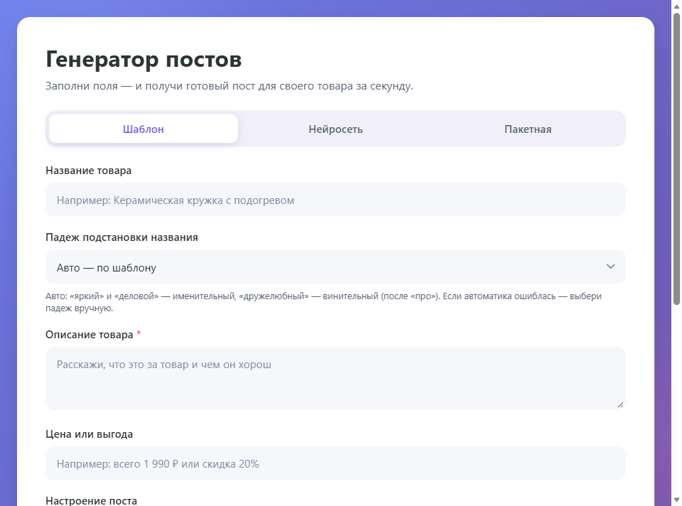
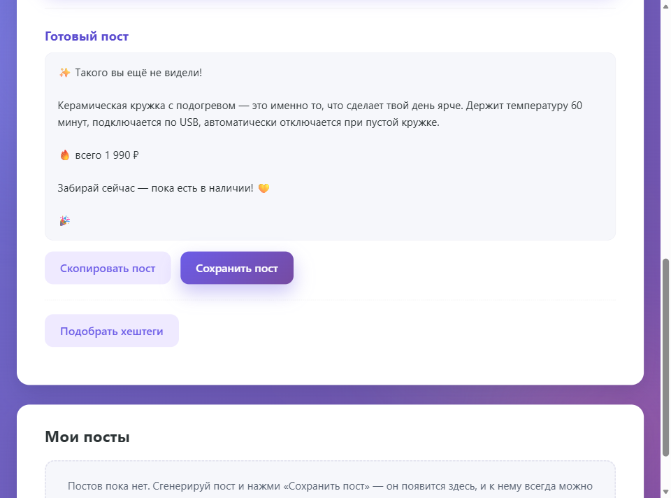
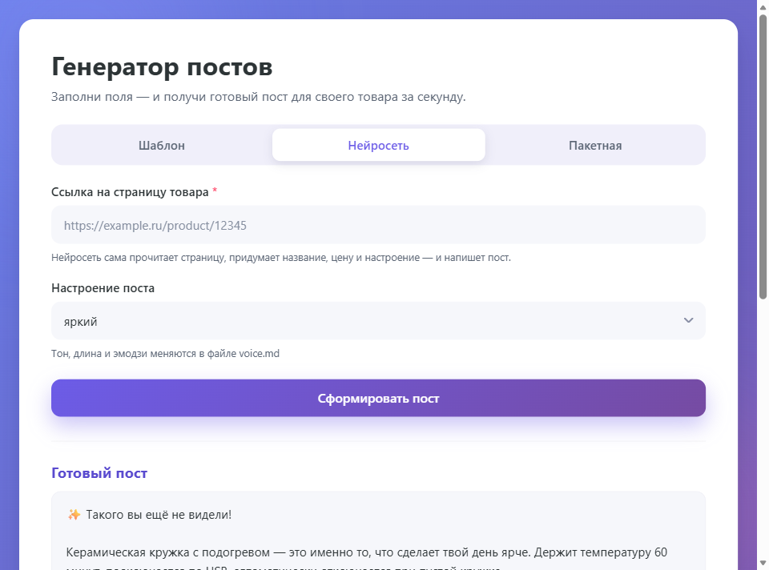

# Генератор постов для товара

Веб-приложение, которое превращает описание товара в готовый пост для соцсетей. Работает в трёх режимах: **«Шаблон»** — текст собирается по готовым заготовкам прямо на вашем компьютере, без интернета и без оплаты; **«Нейросеть»** — вы даёте ссылку на страницу товара, приложение само вытягивает оттуда текст и просит языковую модель написать пост; **«Пакетная»** — вставляется список товаров из Excel или CSV, и посты генерируются одной кнопкой с проверкой дубликатов. Готовые посты сохраняются в разделе «Мои посты» и остаются после перезагрузки страницы, а хештеги подбираются в один клик.

---

## 1. Что делает сервис и для кого он создан

Небольшому магазину нужно каждый день писать посты про товары. Своего копирайтера нет, а самому придумывать текст для десятого чехла подряд — долго и скучно. При этом пост должен звучать в одном узнаваемом тоне, а не по-разному каждый раз.

Генератор закрывает именно это: вы вводите название, описание и выгоду, выбираете настроение — и получаете готовый пост, который можно скопировать одной кнопкой. Тон задаётся настройками, поэтому все посты звучат одинаково «вашим голосом».

Два режима отвечают на разные ситуации:

- **«Шаблон»** — когда нужно быстро и бесплатно. Текст собирается по заготовке, интернет не нужен, оплата тоже.
- **«Нейросеть»** — когда текста о товаре много и лень его пересказывать. Приложение открывает страницу товара, достаёт с неё текст и отдаёт модели, которая пишет пост сама.
- **«Пакетная»** — когда товаров десять и больше. Вставляете строки из таблицы — приложение генерирует посты, находит дубликаты (и в списке, и среди уже сохранённых) и спрашивает, что с ними делать.

Для кого:

- **владелец небольшого магазина** — ведёт соцсети сам и экономит время;
- **SMM-специалист** — быстро готовит черновики постов для каталога;
- **менеджер маркетплейса** — пишет описания в едином стиле;
- **начинающий разработчик** — на этом проекте видно, как устроено приложение на Flask с подключением языковой модели; код подробно прокомментирован.

### Возможности

- **Режим «Шаблон»** — сборка текста из заготовок без интернета и без ключа API.
- **Режим «Нейросеть»** — чтение страницы товара по ссылке и генерация поста языковой моделью.
- **Режим «Пакетная»** — генерация по списку из Excel/CSV: вставка строк из буфера, загрузка файла, проверка и подтверждение дубликатов перед загрузкой.
- **Склонение названия товара** — подставляется в нужный падеж автоматически по шаблону или вручную из списка; склоняется вся фраза, предлоги не ломаются.
- **Хранение постов** — кнопка «Сохранить пост» кладёт результат в раздел «Мои посты»: редактирование, удаление с подтверждением, доступ после перезагрузки.
- **Подбор хештегов** — одна кнопка: сначала языковая модель, без ключа — офлайн-подбор по тексту поста. Чипы можно убирать кликом, копировать одним нажатием.
- **Три настроения** — яркий, деловой, дружелюбный; у каждого свой тон, длина и количество эмодзи.
- **Работа с любым OpenAI-совместимым сервисом** — OpenAI, DeepSeek, OpenRouter, а также локальные модели через Ollama: меняется только адрес и название модели.
- **Кнопка копирования** готового поста в буфер обмена.
- **Проверка полей** — приложение подсказывает, чего не хватает, вместо непонятной ошибки.
- **Настройки голоса вынесены в отдельный файл** `voice.md`, где описано, как добавить своё настроение.

---

## 2. Интерфейс

Главный экран в режиме «Шаблон»: поля товара, выбор падежа подстановки и настроения.



Готовый пост появляется под формой — его можно скопировать или сохранить в раздел «Мои посты», а ниже одной кнопкой подобрать хештеги.



Режим «Нейросеть»: вместо описания товара достаточно ссылки на его страницу.



Сохранённые посты живут в разделе «Мои посты» внизу страницы: превью с бейджами, редактирование и удаление с подтверждением. Режим «Пакетная» вставляет список строк из таблицы, проверяет его и перед загрузкой показывает найденные дубликаты — каждый можно принять или пропустить галочкой.

---

## 3. Системные требования

| Что нужно | Версия | Зачем |
|---|---|---|
| Python | 3.9 и новее | Среда выполнения |
| Git | любая актуальная | Склонировать репозиторий |
| Браузер | Chrome/Edge 90+, Firefox 90+, Safari 15+ | Интерфейс приложения |
| Ключ API языковой модели | — | Только для режима «Нейросеть» |

Операционная система — любая: Windows, macOS, Linux. База данных не нужна: сохранённые посты лежат в обычном текстовом файле `data/posts.json` рядом с кодом.

Интернет нужен при установке зависимостей, а дальше — **только для режима «Нейросеть»**. Режим «Шаблон» работает полностью офлайн.

Проверено на Python 3.14.7 с Flask 3.1.3.

---

## 4. Установка с чистого компьютера

### 4.1. Установите Python

- **Windows:** скачайте установщик с https://www.python.org/downloads/ и на первом экране **обязательно** отметьте галочку «Add Python to PATH».
- **macOS:** установщик с того же сайта или `brew install python`.
- **Linux (Ubuntu/Debian):**

  ```bash
  sudo apt update && sudo apt install -y python3 python3-venv
  ```

Проверьте установку:

```bash
python --version
```

Если команда не найдена, попробуйте `python3 --version`.

### 4.2. Установите Git

- **Windows:** установщик https://git-scm.com/download/win с настройками по умолчанию.
- **macOS:**

  ```bash
  xcode-select --install
  ```

- **Linux (Ubuntu/Debian):**

  ```bash
  sudo apt update && sudo apt install -y git
  ```

### 4.3. Склонируйте репозиторий

```bash
git clone https://github.com/Yaroslava-111/post-generator.git
cd post-generator
```

### 4.4. Создайте виртуальное окружение

Виртуальное окружение — отдельная папка с библиотеками только для этого проекта, чтобы они не конфликтовали с другими программами.

**Windows (PowerShell):**

```powershell
python -m venv .venv
.venv\Scripts\Activate.ps1
```

Если PowerShell откажется выполнять сценарий, разрешите запуск один раз для текущего окна:

```powershell
Set-ExecutionPolicy -Scope Process -ExecutionPolicy Bypass
```

**macOS и Linux:**

```bash
python3 -m venv .venv
source .venv/bin/activate
```

Признак успеха: в начале строки терминала появилась пометка `(.venv)`. Чтобы выйти, выполните `deactivate`; перед каждым запуском окружение активируется заново.

### 4.5. Установите зависимости

```bash
pip install -r requirements.txt
```

Единственная зависимость — Flask. Обращения к языковой модели сделаны на стандартной библиотеке Python, дополнительных пакетов для этого не нужно.

---

## 5. Запуск

В активированном виртуальном окружении:

```bash
python app.py
```

Откройте в браузере:

```text
http://127.0.0.1:5000
```

Остановить сервер — `Ctrl + C` в терминале.

Режим «Шаблон» работает сразу. Чтобы заработал режим «Нейросеть», нужно подготовить файл `.env` — см. раздел 7.

---

## 6. Проверка работоспособности

Автотестов в проекте нет — проверка выполняется вручную за три минуты.

### 6.1. Главный пользовательский сценарий (режим «Шаблон»)

1. Откройте `http://127.0.0.1:5000`.
   **Ожидаемый результат:** открылась форма, активна вкладка **«Шаблон»**.
2. Заполните поля:
   - **Название товара:** `Термокружка «Полярник»`
   - **Описание товара:** `Стальная кружка на 450 мл с двойными стенками и крышкой-непроливайкой.`
   - **Цена или выгода:** `Держит температуру напитка до 8 часов`
3. В поле **«Настроение поста»** выберите **«дружелюбный»**.
4. Нажмите **«Сформировать пост»**.
   **Ожидаемый результат:** ниже появился блок **«Готовый пост»** с текстом, который начинается с приветствия и содержит описание и выгоду.
5. Смените настроение на **«деловой»** и нажмите кнопку ещё раз.
   **Ожидаемый результат:** текст стал суше, эмодзи меньше — значит, настройки тона применяются.
6. Нажмите **«Скопировать»** и вставьте текст в любой редактор.
   **Ожидаемый результат:** пост вставился полностью.
7. Очистите поле **«Описание товара»** и нажмите кнопку генерации.
   **Ожидаемый результат:** появилось понятное сообщение «Опишите товар — без этого пост не собрать», а не техническая ошибка.

Если все семь шагов прошли как описано, базовый режим исправен.

### 6.2. Проверка режима «Нейросеть»

Требует заполненного файла `.env` с ключом API (раздел 7).

1. Переключитесь на вкладку **«Нейросеть»**.
2. Вставьте ссылку на страницу любого товара и нажмите кнопку генерации.
   **Ожидаемый результат:** через несколько секунд появился пост, написанный по содержимому страницы.

Если ключ не задан, приложение прямо сообщит об этом текстом: «Нет ключа API. Скопируй .env.example в .env и впиши OPENAI_API_KEY, затем перезапусти сервер».

### 6.3. Сохранение постов

1. Сгенерируйте пост и нажмите **«Сохранить пост»**.
   **Ожидаемый результат:** в разделе «Мои посты» появилась карточка, счётчик показал «1 пост».
2. Нажмите **«Редактировать»**, измените текст и сохраните.
   **Ожидаемый результат:** в карточке новый текст, дата обновилась.
3. Обновите страницу.
   **Ожидаемый результат:** пост остался на месте — данные лежат в `data/posts.json`.
4. Нажмите **«Удалить»** и подтвердите в диалоге.
   **Ожидаемый результат:** карточка исчезла, список снова пуст.

### 6.4. Пакетная генерация и дубликаты

1. Переключитесь на вкладку **«Пакетная»** и вставьте в поле 2–3 строки в формате `название	описание	выгода	настроение` (через табуляцию).
2. Нажмите **«Проверить список»**.
   **Ожидаемый результат:** появились итоги по каждой строке — «Создано», «Дубликат — пропущен» или причина ошибки.
3. Вставьте ту же строку второй раз и проверьте список ещё раз.
   **Ожидаемый результат:** открылось окно с найденными дубликатами; галочки выключены по умолчанию, счётчик показывает, сколько будет загружено. Нажатие «Отмена» ничего не сохраняет.

### 6.5. Хештеги

1. Сгенерируйте пост и нажмите **«Подобрать хештеги»**.
   **Ожидаемый результат:** под кнопкой появились чипы с тегами и счётчик «N из 30».
2. Кликните по любому чипу.
   **Ожидаемый результат:** тег удалился, счётчик уменьшился.
3. Сохраните пост и обновите страницу.
   **Ожидаемый результат:** теги сохранились вместе с постом и видны в карточке.

Без ключа API хештеги подбираются офлайн по тексту поста — список будет короче, но рабочий.

---

## 7. Переменные окружения и файл `.env.example`

Переменные нужны **только для режима «Нейросеть»**. Режим «Шаблон» работает без них.

Файл `.env.example` лежит в репозитории и содержит **имена** переменных без значений:

| Имя переменной | Назначение |
|---|---|
| `OPENAI_API_KEY` | Ключ доступа к сервису языковой модели |
| `OPENAI_BASE_URL` | Адрес API: OpenAI, DeepSeek, OpenRouter или локальная Ollama |
| `AI_MODEL` | Название модели, которая пишет пост |

Как подготовить файл:

```bash
cp .env.example .env
```

В Windows PowerShell:

```powershell
Copy-Item .env.example .env
```

Откройте `.env`, впишите свои значения и **перезапустите сервер** — переменные читаются при старте.

Файл `.env` перечислен в `.gitignore` и в репозиторий не попадает. **Никогда не коммитьте его и не выкладывайте ключ в открытый доступ.**

Настройки тона — отдельно от секретов: они описаны в файле `voice.md` (общий тон, длина поста, количество эмодзи, стиль заголовка) и там же пошагово объяснено, как добавить собственное настроение.

---

## 8. Структура проекта

```text
post-generator/
├── app.py                  # Весь сервер: маршруты, сборка по шаблону, падежи, хештеги, запрос к модели
├── templates/
│   └── index.html          # Страница приложения
├── static/
│   ├── style.css           # Стили
│   └── script.js           # Логика на стороне браузера
├── data/
│   └── posts.json          # Сохранённые посты (создаётся автоматически, в Git не входит)
├── voice.md                # Настройки голоса: тон, длина, эмодзи, как добавить настроение
├── .env.example            # Имена переменных окружения для режима «Нейросеть»
├── .gitignore              # Что не попадает в репозиторий: .env и data/
├── requirements.txt        # Зависимости
├── docs/screenshots/       # Скриншоты для этого файла
└── README.md
```

---

## 9. Публикация

Приложение рассчитано на локальный запуск. Встроенный сервер Flask (`app.run`) — отладочный, для интернета он не предназначен.

Если приложение всё же нужно разместить на сервере, обязательны три вещи:

1. **Рабочий сервер приложений вместо отладочного.** Например:

   ```bash
   pip install gunicorn
   gunicorn -w 2 -b 0.0.0.0:8000 app:app
   ```

   На Windows вместо `gunicorn` используется `waitress`:

   ```bash
   pip install waitress
   waitress-serve --port=8000 app:app
   ```

2. **Ключ API только в переменных окружения сервера**, а не в файле рядом с кодом.

3. **Ограничение доступа.** У приложения нет авторизации: любой, кто откроет адрес, сможет тратить ваш ключ API. Закройте страницу паролем на уровне веб-сервера или держите её во внутренней сети.

На GitHub Pages приложение разместить нельзя: там работают только статические страницы, а здесь нужен Python на сервере.

---

## 10. Обновление

В папке проекта:

```bash
git pull
```

Затем в активированном виртуальном окружении:

```bash
pip install -r requirements.txt --upgrade
```

Перезапустите сервер и пройдите проверку из раздела 6.1.

Ваш файл `.env` при обновлении не затрагивается — он не входит в репозиторий. Если в `.env.example` появились новые переменные, перенесите их в свой `.env` вручную.

---

## 11. Резервное копирование

Приложение хранит данные в двух местах: настройки тона — в `voice.md`, сохранённые посты — в `data/posts.json`. Оба файла лежат рядом с кодом, база данных не нужна.

Резервного копирования требуют три файла:

| Файл | Почему важен | Как сохранить |
|---|---|---|
| `.env` | Ключ API и настройки сервиса; в репозиторий не входит | Скопируйте в надёжное место: `cp .env .env.backup` |
| `voice.md` | Ваши настройки тона, если вы их меняли | Хранится в Git — достаточно коммита |
| `data/posts.json` | Все сохранённые посты; в репозиторий не входит | Скопируйте в надёжное место: `cp data/posts.json posts.backup.json` |

Если вы правили `voice.md` под свой бренд, сохраните изменения в Git:

```bash
git add voice.md
git commit -m "Свои настройки тона"
```

Так любую прежнюю версию можно вернуть командой `git checkout <хэш-коммита> -- voice.md`.

---

## 12. Известные ограничения

- **Режим «Нейросеть» требует платного ключа API** (кроме случая с локальной моделью через Ollama) и работает только при наличии интернета. Без ключаAI-подбор хештегов отключается — включается офлайн-подбор.
- **Чтение страницы товара срабатывает не везде.**Сайты, которые отрисовывают содержимое скриптами, закрыты защитой от роботов или требуют входа, вернут пустой или бесполезный текст.
- **Нет авторизации и ограничения частоты запросов.** При публикации в интернете ключом API сможет пользоваться любой посетитель.
- **Лимиты пакетной генерации** — до 50 строк за раз шаблоном и до 10 нейросетью; большие списки разбивайте на части.
- **Дубликаты определяются похожестью текста** (совпадение от 85%): один и тот же товар с разным описанием может не распознаться как дубликат.
- **Склонение названия работает не для всех языков** — проверяется только русский; латиница, цифры и заимствования остаются как есть.
- **Встроенный сервер Flask — отладочный** и не рассчитан на нагрузку (раздел 9).

---

## 13. Если что-то не работает

| Что вы видите | Причина | Что сделать |
|---|---|---|
| `python: command not found` | Python не установлен или называется `python3` | Выполните `python3 --version`; при необходимости установите Python с https://www.python.org/downloads/ |
| `ModuleNotFoundError: No module named 'flask'` | Зависимости не установлены или окружение не активировано | Активируйте окружение (раздел 4.4) и выполните `pip install -r requirements.txt` |
| PowerShell: `выполнение сценариев отключено` | Политика запуска сценариев Windows | `Set-ExecutionPolicy -Scope Process -ExecutionPolicy Bypass`, затем снова активируйте окружение |
| `Address already in use` при запуске | Порт 5000 занят другой программой | Закройте программу или запустите на другом порту: `python -c "from app import app; app.run(port=5001)"` |
| «Нет ключа API…» в режиме «Нейросеть», пакетной нейросетью или при подборе хештегов | Файл `.env` не создан или сервер не перезапущен | Скопируйте `.env.example` в `.env`, впишите ключ и перезапустите сервер |
| Ошибка авторизации от сервиса модели | Неверный ключ, закончились средства или не тот адрес API | Проверьте `OPENAI_API_KEY` и `OPENAI_BASE_URL`; `AI_MODEL` должна существовать у выбранного сервиса |
| Нейросеть вернула пост не про тот товар | Со страницы не удалось прочитать полезный текст | Проверьте ссылку в браузере; для таких сайтов используйте режим «Шаблон» |
| Страница открылась без стилей | Не загрузились файлы из `static/` | Убедитесь, что сервер запущен из папки проекта, и обновите страницу сочетанием `Ctrl + F5` |
| Кнопка «Скопировать» не срабатывает | Браузер запрещает доступ к буферу обмена на небезопасной странице | Открывайте приложение по адресу `http://127.0.0.1:5000`, а не по внешнему IP без `https` |

### Где смотреть ошибки

- **Серверные ошибки** печатаются в терминал, где запущен `python app.py` — читайте последние строки.
- **Ошибки в браузере** — `F12` → вкладка **Console**; запросы к серверу видны на вкладке **Network**.

Отдельных файлов журнала приложение не ведёт. Если нужно сохранить вывод сервера в файл:

```bash
python app.py > server.log 2>&1
```

---

## 14. Поддержка

Вопросы, замечания и сообщения об ошибках — через раздел **Issues** этого репозитория: https://github.com/Yaroslava-111/post-generator/issues

Автор проекта: https://github.com/Yaroslava-111
